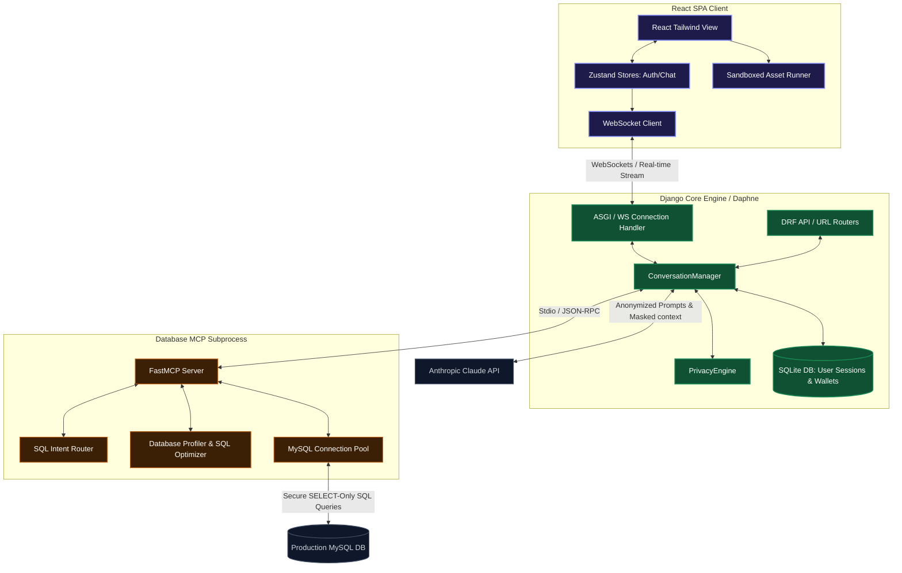

# Nervenet: AI Electricity Analytics & Customer Support System

Nervenet is a state-of-the-art, secure AI customer support, database management, and data analytics platform designed for electricity distribution utility companies. It enables non-technical personnel and support agents to query live database records (tariffs, meter readings, billing histories) using natural language, powered by Anthropic's Claude LLM.

The core system architecture features a **React SPA client**, a **Django ASGI core engine**, a custom **Model Context Protocol (MCP)** database gateway enforcing read-only SELECT queries, and a stateful **Privacy Engine** that guarantees zero leakage of PII (Personally Identifiable Information) to external LLM providers.

---

## 1. Visual Architecture

The diagram below details the end-to-end data flow when a user sends a message. Notice how sensitive client details are tokenized (anonymized) before they ever leave your server, and how database queries are securely processed through the MCP layer.



---

## 2. Core Features

### 🌐 Advanced Chat Interface (React Client)
* **Real-time Streaming:** Smooth WebSocket-based response streaming for chatbot messages.
* **Rich Visualizations (Vega-Lite & D2):** Native, interactive rendering of data charts using **Vega / Vega-Lite**, and dynamic flowchart diagrams, mindmaps, and relationship graphs using **D2** (via WASM).
* **Sandboxed Code & Asset Execution:** Secure, isolated iframe environments rendering raw HTML, SVG, and dynamic JS visual assets (such as Chart.js) generated on-the-fly by the AI.
* **KaTeX Support:** Fast rendering of complex mathematical equations and formulas.
* **File Attachments:** Upload and analyze images, PDFs, and structured documents (CSV, DOCX).
* **Voice-to-Text:** Integrated speech-to-text interface allowing users to dictate queries directly.

### 🔒 Stateful Privacy Engine (PII Masking)
* **Ingress Masking:** Scans incoming prompts using stateful regex logic and replaces phone numbers, names, and customer IDs with tokens (e.g. `<//PHONE-a1b2c3d4//>`).
* **Tool Argument Detokenization:** Decrypts values *only* immediately before running SQL queries against the local database, keeping external API entities completely blind to raw customer IDs.
* **Egress Re-tokenization:** Encrypts raw database outputs back into tokens before delivering them to Claude, ensuring the LLM reasons only over anonymized information.
* **Egress Decryption:** Automatically decrypts final response text just-in-time on the server before serving it to the client UI.

### ⚙️ Database Model Context Protocol (MCP) Subprocess
* **FastMCP Server:** Runs as a separate Python stdio worker process to execute SQL safely.
* **Query Validation:** Intercepts SQL commands to enforce strict read-only queries (`SELECT` statements only). Attempts at `INSERT`, `UPDATE`, `DELETE`, or `DROP` are instantly blocked.
* **Intent Routing & Optimization:** Analyzes user queries to route tasks efficiently, optimizes heavy SQL structures, and caches database schemas to avoid redundant table scans.
* **Performance Metrics:** Profiles query execution times and resources to maintain system health.

### 💳 Token Metering & Wallet System
* **Usage Estimation:** Computes precise pricing based on input/output token counts from Claude's pricing charts.
* **User Wallets:** Deducts funds from user balances in real time on a per-session transaction model.

### 📊 Comprehensive Admin Dashboard
* **Usage & Token Analytics:** Visual representations of active sessions, API token burn rates, and financial costs using Recharts.
* **User Management:** Complete controls over user wallets, credit replenishment, and registration status.
* **MCP Configuration:** Add, configure, edit, and test live connections to external MCP servers.
* **Privacy Audits:** Inspection logs tracking masked vs. unmasked prompts to verify system compliance.

---

## 3. Technology Stack

### Frontend
* **Core:** React 18, TypeScript, Tailwind CSS, Vite
* **State Management:** Zustand
* **Animations:** Framer Motion
* **Charts/Analytics:** Recharts, Vega, Vega-Lite
* **Markdown & Diagrams:** React Markdown, rehype-katex, remark-math, remark-gfm, rehype-raw, and @terrastruct/d2
* **Icons:** Lucide React

### Backend
* **Core Framework:** Django 6.0.6, Django Rest Framework (DRF)
* **Real-time Server:** Daphne (ASGI) & Django Channels 4.0.0
* **API Security:** SimpleJWT (JSON Web Tokens)
* **MCP Integration:** python-mcp, FastMCP
* **Validation & Settings:** Pydantic & Pydantic Settings v2

---

## 4. Directory Structure

```
nervenet/
├── .gitignore                      # Workspace Git ignore configurations
├── backend - nervenet/             # Python Django core app
│   ├── brain/                      # Django project entry point (settings, asgi, urls)
│   ├── conversation/               # Conversation modules (manager, models, controllers)
│   ├── database_mcp/               # Custom FastMCP database tool server
│   │   ├── services/               # Intent router, SQL optimizer, and profiler
│   │   ├── tools/                  # Registered MCP database & utility tools
│   │   └── app.py                  # MCP server runner
│   ├── requirements.txt            # Python package dependencies
│   ├── manage.py                   # Django CLI utility
│   └── db.sqlite3                  # Local SQLite database
└── frontend - nervenet/            # React + TypeScript client
    ├── src/
    │   ├── components/             # Common UI, Chat panels, and settings
    │   ├── hooks/                  # Custom hooks (e.g. WebSocket connector)
    │   ├── pages/                  # Chat pages, Login, and Admin Dashboard (78KB)
    │   ├── store/                  # Zustand auth and chat state stores
    │   └── App.tsx                 # Main application router
    ├── package.json                # NPM configuration and build scripts
    ├── tailwind.config.js          # Tailwind CSS presets
    └── vite.config.ts              # Vite configurations
```

---

## 5. Getting Started

### Prerequisites
- Python 3.10+
- Node.js 18+
- MySQL database (optional, for MCP database integration)

### Setup Backend

1. **Navigate to the Backend Directory:**
   ```bash
   cd "backend - nervenet"
   ```

2. **Initialize Virtual Environment & Install Packages:**
   ```bash
   python -m venv venv
   # On Windows:
   venv\Scripts\activate
   # On macOS/Linux:
   source venv/bin/activate

   pip install -r requirements.txt
   ```

3. **Configure Environment Variables:**
   Create a `.env` file inside the `backend - nervenet` folder:
   ```env
   # LLM Keys
   ANTHROPIC_API_KEY=your-anthropic-api-key
   OPENAI_API_KEY=your-openai-api-key

   # External Production MySQL Database Config
   DB_HOST=YOUR_DB_HOST
   DB_PORT=YOUR_PORT
   DB_USER=YOUR_DB_USER
   DB_PASSWORD=your-database-password
   DB_NAME=YOUR_DB_NAME
   ```

4. **Run Migrations & Launch Server:**
   ```bash
   python manage.py migrate
   python manage.py runserver
   ```
   *Note: For production or WebSocket support, serve using Daphne:*
   ```bash
   daphne -b 127.0.0.1 -p 8000 brain.asgi:application
   ```

### Setup Frontend

1. **Navigate to the Frontend Directory:**
   ```bash
   cd "frontend - nervenet"
   ```

2. **Install Dependencies:**
   ```bash
   npm install
   ```

3. **Configure Environment:**
   Vite loads properties prefixed with `VITE_`. Setup the following in a `.env` file under `frontend - nervenet`:
   ```env
   VITE_API_URL=http://localhost:8000/api
   VITE_WS_URL=ws://localhost:8000/api/ws/chat
   ```

4. **Launch Dev Server:**
   ```bash
   npm run dev
   ```
   Open `http://localhost:5173` in your browser.
