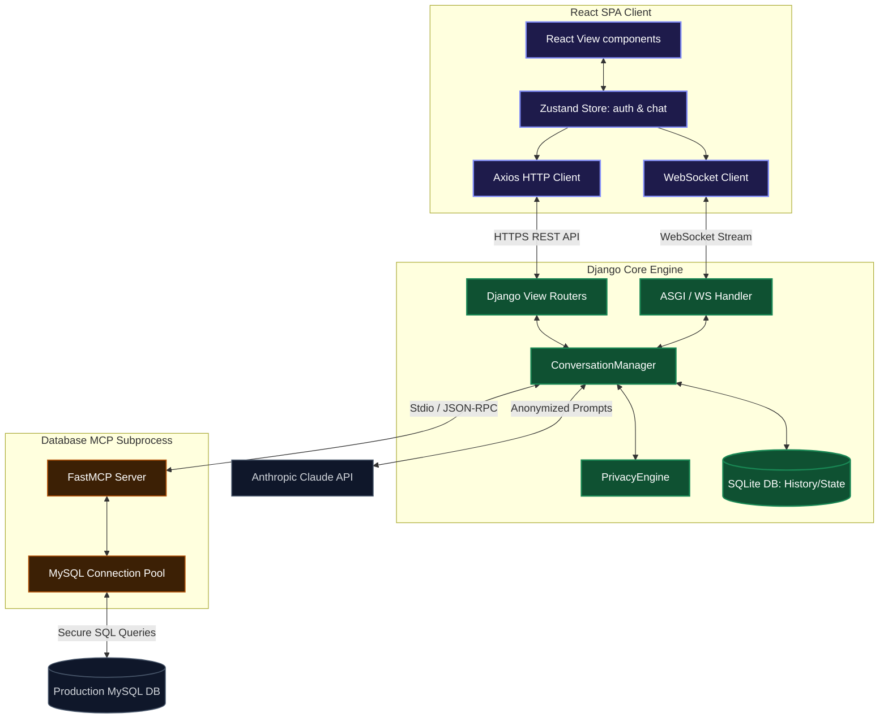
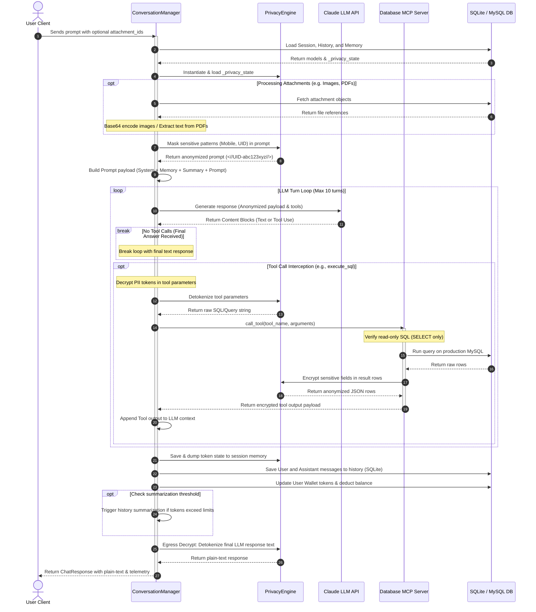

# Nervenet System Architecture & Design

This document describes the system design patterns, component relationships, data flow sequences, and database schemas of the integrated Nervenet platform.

---

## 1. Integrated System Architecture

The Nervenet application utilizes a decoupled, high-performance architecture supporting real-time streaming, homomorphic data tokenization (privacy), and Model Context Protocol (MCP) database security.

1. **React SPA Client**: Employs Zustand stores for authentication and conversation state. Features dynamic Markdown rendering alongside an isolated sandboxed iframe for rendering dynamic visual HTML assets (like Chart.js configurations) and Mermaid diagrams on the fly.
2. **Django Core Engine (ASGI)**: Manages authentication, SQLite message logs, token tracking, user wallets, and privacy mappings. Utilizes `daphne`/ASGI Channels to support concurrent WebSockets.
3. **Database MCP Subprocess**: Secure Model Context Protocol database interface running as an isolated subprocess (`stdin`/`stdout`). It connects to the MySQL production database, validating that all SQL calls are strictly read-only SELECT queries.

---

## 2. Conversation Engine Component Architecture

The `conversation` module within the Django Core Engine encapsulates the AI interaction logic, orchestrating session tracking, token counts, LLM integrations, and PII masking.

| Component Name | File | Primary Responsibility |
| :--- | :--- | :--- |
| **`ConversationManager`** | [`manager.py`](file:///e:/BSS/nervenet/backend%20-%20nervenet/conversation/manager.py) | The core orchestrator. Coordinates the message processing pipeline, tool execution loops, DB updates, wallet charges, and egress decryption. |
| **`PrivacyEngine`** | [`privacy_engine.py`](file:///e:/BSS/nervenet/backend%20-%20nervenet/conversation/privacy_engine.py) | Stateful PII tokenizer. Employs regex to mask phone numbers/UIDs, and handles record-level mapping of DB query outputs. |
| **`SessionManager`** | [`session_manager.py`](file:///e:/BSS/nervenet/backend%20-%20nervenet/conversation/session_manager.py) | Creates, updates, loads, and manages lifetimes of user chat sessions. |
| **`HistoryManager`** | [`history_manager.py`](file:///e:/BSS/nervenet/backend%20-%20nervenet/conversation/history_manager.py) | Manages sequential storage and retrieval of raw/encrypted messages in the local SQLite DB. |
| **`MemoryManager`** | [`memory_manager.py`](file:///e:/BSS/nervenet/backend%20-%20nervenet/conversation/memory_manager.py) | Persists transient workspace metadata, including the runtime `_privacy_state` token map. |
| **`SummaryManager`** | [`summary_manager.py`](file:///e:/BSS/nervenet/backend%20-%20nervenet/conversation/summary_manager.py) | Runs incremental summarization of older chat history when context size exceeds thresholds. |
| **`PromptBuilder`** | [`prompt_builder.py`](file:///e:/BSS/nervenet/backend%20-%20nervenet/conversation/prompt_builder.py) | Constructs the structured JSON payloads for the Anthropic Claude API, injecting system instructions, active memory, summaries, and text/image inputs. |
| **`LLMManager`** | [`llm_manager.py`](file:///e:/BSS/nervenet/backend%20-%20nervenet/conversation/llm_manager.py) | Simple provider wrapper mapping model settings and invoking raw completions. |
| **`TokenManager`** | [`token_manager.py`](file:///e:/BSS/nervenet/backend%20-%20nervenet/conversation/token_manager.py) | Calculates financial costs using actual API token metrics and estimates window constraints. |
| **`TitleGenerator`** | [`title_generator.py`](file:///e:/BSS/nervenet/backend%20-%20nervenet/conversation/title_generator.py) | Compiles the initial chat turns to generate a contextually relevant title for empty sessions. |

---

## 3. Dynamic Message Processing Pipeline

The dynamic flow of a user message through `ConversationManager.process_message()` progresses through the following sequential phases:

### Key Stages of the Pipeline:
1. **Session & Memory Hydration**: Loads session metadata. De-serializes the stateful `_privacy_state` mapping dictionary into the `PrivacyEngine` instance, ensuring that previously tokenized items retain identical mappings across chat turns.
2. **Attachment Handling**: Identifies attachment types. 
   - *Images*: Base64 encoded and attached as Claude Vision API blocks.
   - *PDFs*: Scrapes text directly. For scanned or image-only PDFs, extracts pages as image blocks.
   - *Structured Documents (CSV, DOCX, etc.)*: Injects extracted text inline within the prompt context.
3. **Anonymization & Tokenization**: User inputs are run through regex engines detecting 10-digit mobile numbers and 7/11-digit customer IDs, substituting them with cryptographically unique tokens (e.g. `<//PHONE-a1b2c3d4//>`).
4. **Tool-Call Interception**: Intercepts generated tool inputs. Replaces tokenized parameters back with raw values immediately before passing them to the Database MCP. Upon completion, encrypts the database rows before feeding them back to the LLM.
5. **Session Cost Allocation**: Accumulates the prompt and completion tokens, converts them into financial values based on Claude pricing models, and deducts the expense from the user's active wallet balance.

---

## 4. Database Schema Mappings

The MCP server connects to the `analytics_demo` MySQL database containing 7 tables:

1. **`consumer_master`**: Base customer registration (PII: `consumer_name`, `consumer_no`, `mobile_no`, `address`).
2. **`billing_transactions`**: Historical energy charge invoices and arrear statuses.
3. **`meter_readings`**: Monthly consumption records (PII: `latitude`, `longitude`, `gps_captured`). Contains reader logs.
4. **`feeder_master`**: Electricity feeder networks.
5. **`dtr_master`**: Distribution Transformer Stations.
6. **`meter_reader_master`**: Meter readers (PII: `meter_reader_name`, `mobile_no`).
7. **`hierarchy`**: Circles, divisions, subdivisions, and sections defining company organizational hierarchy.

---

## 5. Known Design Constraints & Vulnerabilities

### PII Leak via Summarization Pipeline
There is an identified security gap in the current conversation summarization logic:
- **Location**: [`summary_manager.py:L65-77`](file:///e:/BSS/nervenet/backend%20-%20nervenet/conversation/summary_manager.py#L65-L77)
- **Vulnerability**: The SQLite database stores user messages in plain-text. When `SummaryManager.summarize_history()` gathers historical messages to build a consolidated summary, it reads the plain-text message logs and submits them directly to the LLM summarizer without running them through the privacy tokenization filter.
- **Architectural Resolution**: Update the summarizer script to execute `privacy_engine.tokenize_text()` on the history content block prior to submission, or execute the summarization context on a pre-masked history pipeline.

