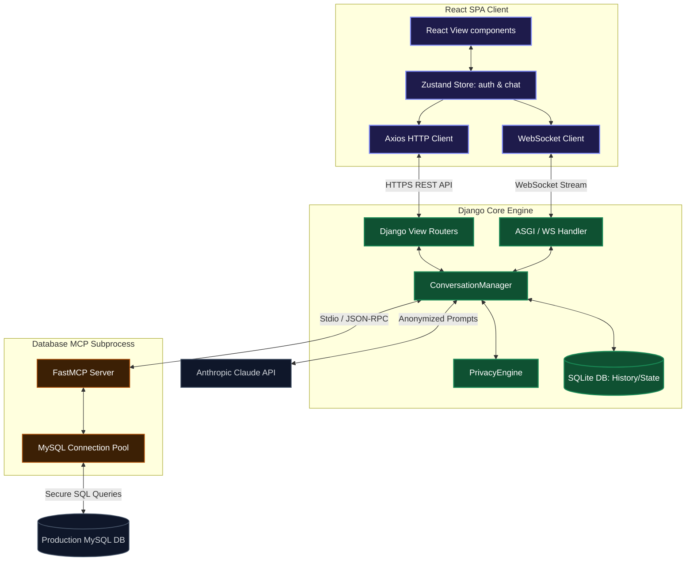
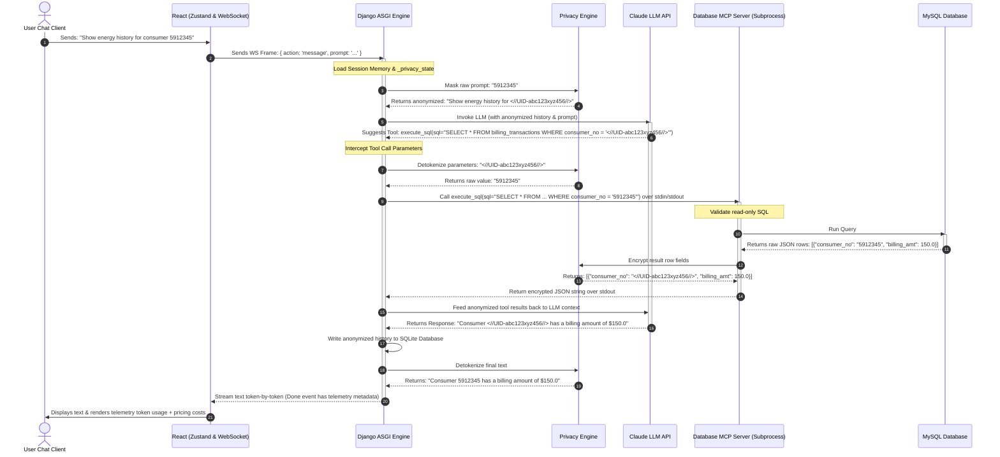

# Nervenet System Architecture & Design

This document describes the updated system design patterns, component relationships, data flow sequences, and database schemas of the integrated Nervenet platform.

---

## 1. Integrated System Architecture

The Nervenet application utilizes a decoupled, high-performance architecture supporting real-time streaming, homomorphic data tokenization (privacy), and Model Context Protocol (MCP) database security.

1. **React SPA Client**: Employs Zustand stores for authentication and conversation state. Features dynamic Markdown rendering alongside an isolated sandboxed iframe for rendering dynamic visual HTML assets (like Chart.js configurations) and Mermaid diagrams on the fly.
2. **Django Core Engine (ASGI)**: Manages authentication, SQLite message logs, token tracking, user wallets, and privacy mappings. Utilizes `daphne`/ASGI Channels to support concurrent WebSockets.
3. **Database MCP Subprocess**: Secure Model Context Protocol database interface running as an isolated subprocess (`stdin`/`stdout`). It connects to the MySQL production database, validating that all SQL calls are strictly read-only SELECT queries.

---

## 2. Privacy Anonymization & Tool Calling sequence

All user queries containing sensitive customer data (mobile numbers, UIDs, etc.) are homomorphically tokenized using the backend `PrivacyEngine` before prompt delivery to Claude.

---

## 3. Database Schema Mappings

The MCP server connects to the `analytics_demo` MySQL database containing 7 tables:

1. **`consumer_master`**: Base customer registration (PII: `consumer_name`, `consumer_no`, `mobile_no`, `address`).
2. **`billing_transactions`**: Historical energy charge invoices and arrear statuses.
3. **`meter_readings`**: Monthly consumption records (PII: `latitude`, `longitude`, `gps_captured`). Contains reader logs.
4. **`feeder_master`**: Electricity feeder networks.
5. **`dtr_master`**: Distribution Transformer Stations.
6. **`meter_reader_master`**: Meter readers (PII: `meter_reader_name`, `mobile_no`).
7. **`hierarchy`**: Circles, divisions, subdivisions, and sections defining company organizational hierarchy.
